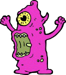
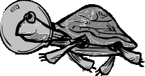
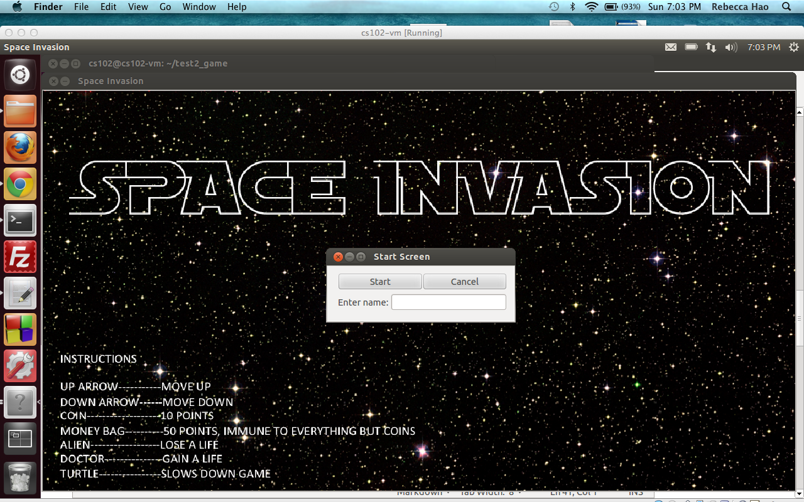
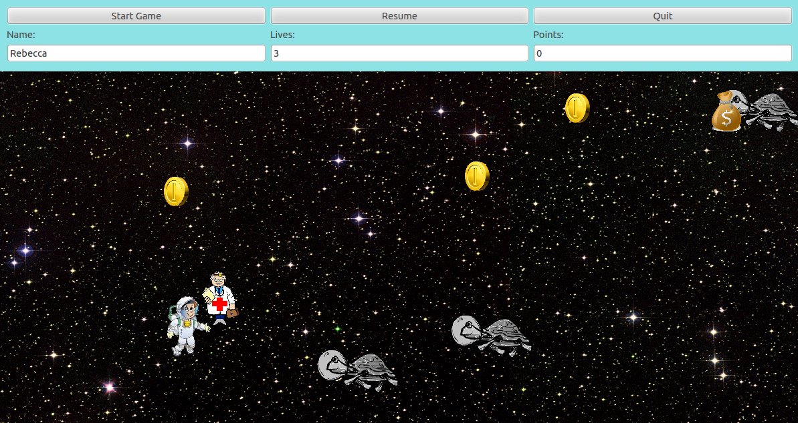

#Alien Invasion Game Design Document
##CSCI 102, PA 5

###Five Things:
  - Coin
    * Player earn ten points for each coin.
    * Coins bounce off the top of the screen, but fall off the bottom of the screen.
    * Coins look like gold coins.
    

  - Money Bag
    * Player will be temporarily unaffected by every item except for coins.
    * Money bags bounce off top and bottom of screen.
    * Money bags look like sacks of money.
    

  - Alien
    * Alien kills player when they collide.
    * Aliens move in a straight, horizontal line.
    * Aliens look like an evil looking alien, along the lines of the picture below.
    

  - Doctor
    * Player gains a life after colliding with doctor.
    * Doctor bounces off top and bottom of screen, so he always appears to be moving diagonally.
    * Doctor looks like a doctor in a space suit. The image below does not have a space suit, but the doctor will.

  - Space Turtle
    * Slows down every part of game except for the player when hit.
    * Space turtle crawls along in a horizontal line.
    * Space turtle looks like a turtle in a space suit.

###Game Play
Player uses keyboard to play game. The up arrow moves the player up. The down arrow moves the player down. The player will use a combination of mouse and keyboard inputs to perform actions such as starting the game and entering a name.

###Scoring
The score goes up by ten points every time a coin is collected. This happens when the player and coin collids. The score goes up by fifty points when the player collides with a money bag. The score cannot go down. 

###Player Lives
Players start the game with three lives. After colliding with the Alien, the player loses a life. After colliding with the Doctor, the player gains a life. The player dies, or the game ends, when the player has lost all lives.

###User Interface Layout
  * Start button
    - Starts a new game, as long as a name has been entered in the name line edit.
  * Pause button
    - Pauses the game if a game is being played. Switches to a Resume button when the game is being paused.
  * Quit button
    - Quits the game application.
  * Popup Box
    - Allows the player to enter username, then click Start button to begin game or Cancel.
    - A picture is shown below.
  * Game output line edits
    - Displays the user's name, number of lives, and points.
  * Game play scene
    - Game is actually implemented, played, and displayed here. This is under all the previous items. 
    - A picture is shown below.
    
 
 
 
  
